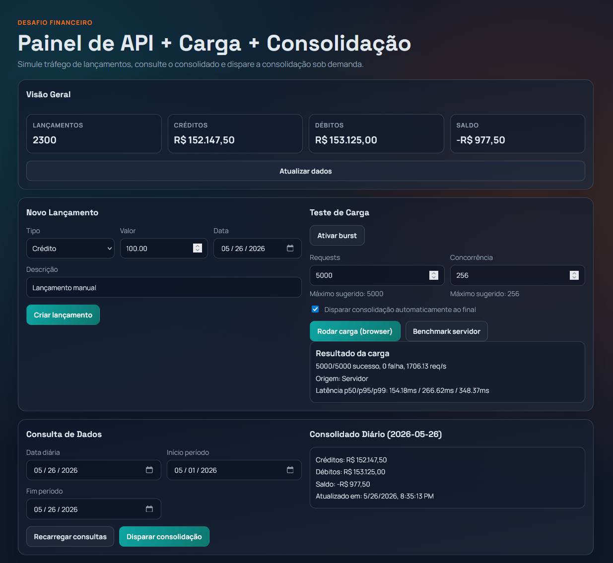
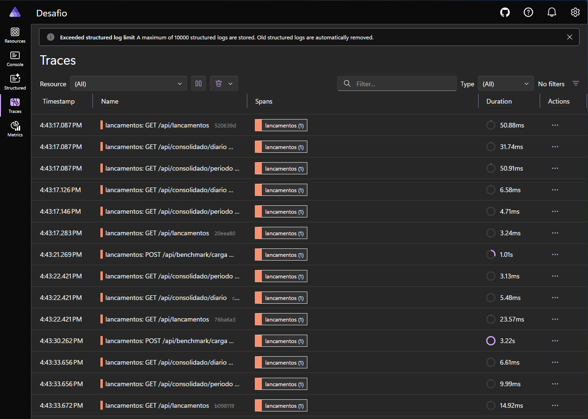
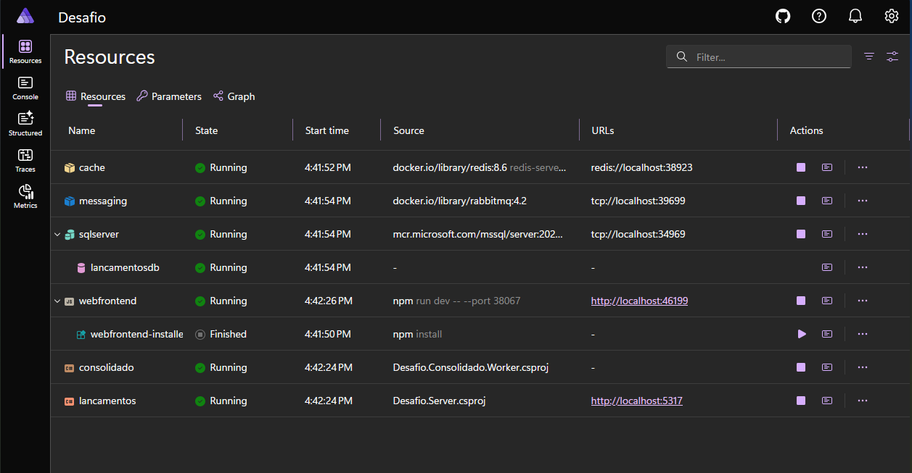

# Desafio — Sistema de Fluxo de Caixa

> **Arquitetura de software escalável e resiliente para controle de lançamentos financeiros e consolidado diário.**

---

## Índice

1. [Arquitetura Cloud Principal (Azure)](#11-arquitetura-cloud-principal-azure)
2. [Arquitetura Cloud de Fallback (AWS)](#12-arquitetura-cloud-de-fallback-aws)
3. [Decisões Arquiteturais](#2-decisões-arquiteturais)
4. [Arquitetura de Código](#3-arquitetura-de-código)
5. [Requisitos Não Funcionais](#4-requisitos-não-funcionais)
6. [Segurança](#5-segurança)
7. [Testes e Validação](#6-testes-e-validação)
8. [Como abrir o DevContainer e rodar o .NET Aspire](#7-como-abrir-o-devcontainer-e-rodar-o-net-aspire)

---

## 1.1. Arquitetura Cloud Principal (Azure)

Um comerciante precisa controlar o fluxo de caixa diário com lançamentos (débitos e créditos) e consultar um relatório de saldo diário consolidado.

A arquitetura principal da solução foi desenhada para Azure, por ser a nuvem mais aderente ao cenário proposto no README e à composição principal do sistema.

Ela é composta por:

- **Azure APIM** para autenticação, autorização e rate limit
- **Microsoft Entra ID** para autenticação e autorização baseada em identidade
- **Container Apps** para execução das APIs com escalonamento baseado em uso de recursos (CPU/RAM) e indicadores de latência (p50/p90)
- **Azure SQL** para persistência transacional e leitura de consolidado
- **Azure Cache for Redis** para cache distribuído de consolidado diário

### Status de implementação (estado atual do código)

- O fluxo de lançamentos grava evento na outbox e publica assíncronamente via `OutboxProcessor`.
- Em ambiente local com Aspire, a mensageria utiliza **RabbitMQ** (`ConnectionStrings:messaging` em formato AMQP).
- Em nuvem, o mesmo contrato de mensageria suporta **Azure Service Bus** (Azure) e **Amazon SQS** (AWS).
- O worker de consolidado opera em modo **event-driven** quando há broker configurado; sem broker, entra em **fallback por polling** para manter disponibilidade funcional.
- Benchmark prático executado em container com **2 vCPU** e **2 GB RAM** atingiu, em média, **1300 req/s** (cenário não otimizado).

Existem diversas maneiras de satisfazer os requisitos deste desafio, mas, por ser uma demanda baixa (picos de apenas 50 req/s), o ideal é manter a simplicidade sem perder a robustez.
Azure APIM centraliza os endpoints e a autenticação.
Container Apps é capaz de escalonar horizontal e verticalmente conforme a demanda do projeto venha a crescer.
Azure SQL e Cache for Redis são serviços gerenciados, reduzindo a manutenção e o suporte.

A demanda inicial do projeto é tão pequena que um simples serviço em uma VPS/Container com um banco SQLite seria mais do que suficiente.
Mas, levando em consideração a necessidade de ter um sistema resiliente e robusto, o ideal é a utilização de serviços gerenciados para garantir estabilidade e uptime.
Existem diversas maneiras de otimizar ainda mais o consumo de memória e a quantidade de requisições em paralelo; uma delas seria utilizar IAsyncEnumerable<T> para consultas e retornos.
Para este demo, não foram realizados benchmarks completos nem otimizações desnecessárias para a escala atual.

Caso o projeto venha a crescer, a estrutura atual supre todas as necessidades.
Caso haja necessidade de escalonar para outras regiões/países, o ideal seria a utilização do Azure Front Door para gerenciar o balanceamento de carga para a região mais próxima do cliente.
.NET Aspire já oferece a infraestrutura como código, mas, para mais controle e padronização, o ideal seria a utilização de CI/CD para publicação.

## 1.2. Arquitetura Cloud de Fallback (AWS)

A arquitetura em AWS foi modelada como uma alternativa de fallback e portabilidade, reutilizando o mesmo núcleo de negócio da solução principal. O objetivo desta seção é demonstrar que a solução não está rigidamente acoplada a uma única nuvem e que os adaptadores de infraestrutura permitem operação equivalente em outro provedor.

Ela é composta por:

- **Amazon API Gateway** para autenticação, autorização e rate limit
- **Amazon Cognito** para autenticação e autorização baseada em identidade
- **Amazon ECS/Fargate** para execução do monólito principal
- **AWS Lambda** para extração de endpoints específicos ou fluxos assíncronos quando houver necessidade de escalabilidade isolada
- **Amazon RDS** para persistência transacional e leitura de consolidado
- **Amazon ElastiCache for Redis** para cache distribuído de consolidado diário
- **Amazon SQS** para desacoplamento entre gravação e consolidação
- **AWS Secrets Manager** para gerenciamento de segredos

A lógica de negócio é a mesma da solução principal em Azure, mas com os adaptadores de infraestrutura substituídos por serviços nativos da AWS.

Obs.: para redução de custos, seria interessante a utilização de CPUs ARM, tendo em vista que o .NET compila sem necessidade de alterações no código.

Nesse desenho, o caminho preferencial em AWS acompanha a estratégia principal da solução: manter o monólito modular hospedado em **ECS/Fargate**. O uso de **Lambda** entra como evolução pontual para endpoints específicos, cargas sazonais ou integrações que se beneficiem de escalabilidade independente.

### Visão geral do fluxo

O fluxo abaixo mostra os componentes equivalentes entre Azure e AWS para a mesma arquitetura lógica.

```
┌─────────────────────────────────────────────────────────────────┐
│                         CLIENTES                                │
│              (Browser / Mobile / Integrações)                   │
└───────────────────────┬─────────────────────────────────────────┘
                        │ HTTPS
┌───────────────────────▼─────────────────────────────────────────┐
│               AZURE APIM / AMAZON API GATEWAY                   │
│         (Autenticação, Autorização, Rate Limiting)              │
└───────────────────────┬─────────────────────────────────────────┘
                        │
          ┌─────────────▼──────────────┐
          │       Desafio.Server       │   ← Container Apps / ECS-Fargate
          │   (Monólito modular API)   │
          │  Vertical Slices + CQRS    │
          └──────┬──────────┬──────────┘
                 │          │
    ┌────────────▼───┐   ┌───▼──────────────┐
    │  Azure SQL /   │   │   Azure Cache /  │
    │  Amazon RDS    │   │   ElastiCache    │
    │  (Write/Read)  │   │   for Redis      │
    │  Lancamentos   │   │   (5 min TTL)    │
    │  OutboxMsgs    │   └──────────────────┘
    └────────┬───────┘
             │ Outbox Pattern (polling)
    ┌────────▼──────────────────────────────┐
    │           OutboxProcessor             │
    │     (publica em Service Bus / SQS)    │
    └────────┬──────────────────────────────┘
             │
    ┌────────▼──────────────────────────────┐
    │  Azure Service Bus / Amazon SQS + DLQ │
    │   Entrega assíncrona e reprocesso     │
    └────────┬──────────────────────────────┘
             │ LancamentoCriadoEvent
    ┌────────▼──────────────────────────────┐
    │  Desafio.Consolidado.Worker / Lambda  │
    │  (serviço separado de consolidação)   │
    └───────────────────────────────────────┘
```

  > Em runtime local, o caminho padrão é RabbitMQ; em ambientes sem broker configurado, o worker usa fallback por polling.

> **Princípio-chave:** O serviço de lançamentos **nunca** fica indisponível por falha no Worker de consolidado. O Outbox garante entrega de eventos e consistência eventual.

### Escalabilidade

- ECS/Fargate permite escalar o monólito horizontalmente sem gerenciar servidores
- SQS absorve picos de processamento e desacopla a taxa de entrada da taxa de consumo
- Lambda pode ser usado para escalar endpoints ou fluxos específicos de forma isolada
- Redis reduz a carga de leitura no banco durante picos

### Resiliência

- Outbox Pattern evita perda de eventos no dual write
- Mensageria assíncrona desacopla API de lançamentos do consolidado
- Fila com DLQ permite reprocessamento e tratamento de falhas sem bloquear a API
- Processador independente, com retomada automática quando volta a consumir a fila
- Falhas no consolidado não interrompem o serviço de lançamentos

### Segurança

- API Gateway como camada de borda para rate limit e políticas de acesso
- Cognito para autenticação/autorização
- Segredos em gerenciador seguro (Secrets Manager)
- Logs estruturados para trilha de auditoria

### Integração

- Eventos de domínio publicados via barramento de mensagens
- Contratos assíncronos entre serviço de lançamentos e consolidação
- Abstrações de infraestrutura permitem operação multi-cloud (Azure/AWS)
- Mesma lógica de negócio, mudando apenas adaptadores de infraestrutura

---

## 2. Decisões Arquiteturais

### Estilo arquitetural escolhido

A solução principal foi desenhada como um **monólito modular com processamento assíncrono**, e não como um conjunto inicial de microsserviços independentes.

Essa decisão foi tomada porque a carga informada no desafio é moderada, o domínio é pequeno e a principal exigência não funcional está no desacoplamento entre escrita e consolidação. Nesse cenário, separar os domínios por módulos e introduzir mensageria apenas no ponto crítico traz melhor relação entre simplicidade, custo operacional e resiliência.

No recorte de infraestrutura, a **plataforma principal considerada é Azure**. A modelagem em AWS existe como demonstração de portabilidade arquitetural e domínio técnico multi-cloud, não como substituição da proposta principal.

### Trade-offs assumidos

- **Pró:** menor complexidade operacional, deploy mais simples e menor custo de observabilidade e troubleshooting.
- **Pró:** evolução mais rápida para o desafio, sem abrir mão de desacoplamento entre lançamento e consolidado.
- **Pró:** a divisão por Vertical Slices facilita futura extração de módulos para microsserviços, caso a escala ou a organização do time exijam isso.
- **Contra:** menor independência de deploy entre módulos quando comparado a microsserviços puros.
- **Contra:** parte do isolamento é lógico e arquitetural, não necessariamente físico, na solução principal.

### Padrões adotados

- **Vertical Slices** para organizar a aplicação por funcionalidade.
- **CQRS leve** para separar fluxos de escrita e leitura sem adicionar complexidade desnecessária.
- **Outbox Pattern** para garantir publicação confiável de eventos após persistência transacional.
- **Cache-aside** para reduzir latência e carga de leitura do consolidado diário.
- **Mensageria assíncrona** para desacoplar o serviço de lançamentos do consolidado.
- **Ports and Adapters** para manter Azure como alvo principal e permitir fallback para AWS com o mesmo núcleo de negócio.

### Estratégia de evolução

Caso a demanda cresça ou surjam requisitos de autonomia por domínio, os módulos atuais permitem evolução gradual para:

- microsserviços dedicados para lançamentos e consolidado;
- serverless para picos sazonais ou integrações específicas;
- múltiplas regiões com roteamento global;
- particionamento de leitura e escrita conforme o crescimento do volume transacional.

---

## 3. Arquitetura de Código

### Estrutura de projetos

```
src/
├── Desafio.AppHost/              # Orquestrador local (.NET Aspire)
├── Desafio.Server/               # API de Lançamentos (Minimal API)
├── Desafio.Consolidado.Worker/   # Worker de Consolidação (Background Service)
├── Desafio.Features/             # Lógica de negócio (Vertical Slices)
│   ├── Common/                   # Entidades, DTOs, Handlers, Auth, Outbox
│   ├── Lancamentos/              # Criar, Listar, ObterPorId
│   ├── Consolidado/              # ObterDiario, ObterPeriodo, Disparar
│   └── Benchmark/                # Teste de carga interno
├── Desafio.Infrastructure/       # EF Core, Redis, Outbox (SQL Server)
├── Desafio.Infrastructure.Azure/ # Azure Service Bus, Key Vault
├── Desafio.Infrastructure.Aws/   # AWS SQS, Secrets Manager
├── Desafio.Functions.Azure/      # Host alternativo Azure Functions
├── Desafio.Functions.Aws/        # Host alternativo AWS Lambda
├── Desafio.Tests.Unit/           # Testes unitários (xUnit + NSubstitute)
├── frontend/                     # Frontend React + Vite + TypeScript
└── infra/
    └── aws/
        ├── template.yaml         # SAM
        └── cdk/                  # CDK
```

### Vertical Slices com divisões lógicas e físicas

- Divisão lógica por funcionalidade (Lancamentos, Consolidado, Benchmark)
- Cada slice concentra endpoint, request/response e handler
- Divisão física flexível:
  - API monolítica modular para cenário principal
  - Hosts em Functions (Azure/AWS) para cenários serverless
- Mesmo núcleo de negócio reutilizado em diferentes hosts

Com a divisão lógica por funcionalidade, isso facilita a migração para microsserviços, caso haja necessidade.
Separar alguns endpoints críticos em Azure Functions/AWS Lambdas se torna prático e rápido, conforme projetos de exemplo (não são utilizados no Aspire, mas estão presentes para demonstração).

### Cache

- Cache-aside com Redis no consolidado diário
- Chave por data com TTL de 5 minutos
- Invalidação após recalcular consolidado
- Redução de latência e de carga no banco em picos

### Serviço separado para consolidação de dados

- Consolidação executa em serviço dedicado: `Desafio.Consolidado.Worker`
- Cálculo de débito/crédito/saldo desacoplado da API de escrita
- Processamento assíncrono a partir de eventos de lançamento (RabbitMQ / Service Bus / SQS)
- Fallback de processamento por polling quando não há barramento configurado
- API segue disponível mesmo quando o worker está indisponível

### Logs e tracing

- Logging estruturado por request e por handler
- OpenTelemetry para traces distribuídos
- Correlação entre API, banco, cache e processamento assíncrono
- Base de observabilidade para métricas de latência (p50/p90), erro e throughput

### Evidência visual da aplicação

A imagem abaixo mostra o painel funcional da solução, com criação de lançamento, execução de carga, consulta e disparo de consolidação no mesmo fluxo operacional.



### Endpoints da API

#### Lançamentos

| Método | Endpoint | Descrição |
|---|---|---|
| `POST` | `/api/lancamentos` | Cria um novo lançamento (débito ou crédito) |
| `GET` | `/api/lancamentos` | Lista lançamentos (filtro opcional por `data`) |
| `GET` | `/api/lancamentos/{id}` | Obtém um lançamento por ID |

Exemplo — Criar lançamento:

```json
POST /api/lancamentos
{
  "tipo": "Credito",
  "valor": 1500.00,
  "descricao": "Venda de produto",
  "data": "2025-01-15"
}
```

Resposta:

```json
HTTP 201 Created
{
  "id": "3fa85f64-5717-4562-b3fc-2c963f66afa6",
  "tipo": "Credito",
  "valor": 1500.00,
  "descricao": "Venda de produto",
  "data": "2025-01-15",
  "criadoEm": "2025-01-15T10:30:00Z"
}
```

#### Consolidado

| Método | Endpoint | Descrição |
|---|---|---|
| `GET` | `/api/consolidado/diario?data=2025-01-15` | Saldo consolidado de um dia |
| `GET` | `/api/consolidado/periodo?dataInicio=2025-01-01&dataFim=2025-01-31` | Saldo consolidado de um período |
| `POST` | `/api/consolidado/disparar` | Dispara reprocessamento manual |

Exemplo — Saldo diário:

```json
GET /api/consolidado/diario?data=2025-01-15
{
  "data": "2025-01-15",
  "totalDebitos": 500.00,
  "totalCreditos": 1500.00,
  "saldo": 1000.00,
  "atualizadoEm": "2025-01-15T10:35:00Z"
}
```

---

## 4. Requisitos Não Funcionais

### Metas arquiteturais

- O serviço de lançamentos deve continuar disponível mesmo que o serviço de consolidado esteja indisponível.
- O consolidado deve suportar picos de **50 requisições por segundo**, com tolerância máxima de **5% de perda**, conforme o enunciado.
- Eventos persistidos no banco não devem ser perdidos por falhas temporárias no barramento ou no processador.
- O tempo de resposta do consolidado diário deve se beneficiar de cache para reduzir pressão no banco em cenários de pico.

### Como a arquitetura atende a essas metas

- A gravação do lançamento e o registro do evento na outbox ocorrem no contexto transacional da aplicação.
- A publicação assíncrona do evento desacopla a API de escrita do processamento do consolidado.
- O worker de consolidação pode ser reiniciado ou escalado de forma independente da API.
- O uso de Redis evita recalcular o consolidado a cada leitura repetida.
- O uso de fila permite amortecer picos e processar backlog após falhas temporárias.

### Evidências atuais e pendências de validação

- Cobertura automatizada atual: **testes unitários** de domínio e handlers.
- O cenário de **50 req/s com no máximo 5% de perda** está contemplado no desenho e em benchmark manual, mas ainda requer validação automatizada fim a fim para evidência objetiva.

### Métricas operacionais recomendadas

- latência p50, p90 e p95 dos endpoints de lançamentos e consolidado;
- taxa de erro da API;
- profundidade da fila e tempo de envelhecimento das mensagens;
- quantidade de mensagens reprocessadas e enviadas para DLQ;
- taxa de acerto de cache do consolidado diário;
- status dos health checks da API, worker, banco e cache.

---

## 5. Segurança

### Controles adotados

- Arquitetura-alvo de autenticação/autorização na borda: **APIM + Entra ID** (Azure) ou **API Gateway + Cognito** (AWS).
- Implementação atual em desenvolvimento local: middlewares **mock** (`MockApimMiddleware`, `MockEntraIdMiddleware`, `MockApiGatewayMiddleware`, `MockCognitoMiddleware`) para simular validação de credenciais.
- Segredos mantidos fora do código, usando **Key Vault** em Azure e **Secrets Manager** em AWS.
- Separação entre núcleo de negócio e adaptadores de infraestrutura, reduzindo acoplamento com SDKs específicos.
- Logs estruturados para auditoria e correlação entre requisições síncronas e processamento assíncrono.

### Boas práticas consideradas

- uso de TLS em trânsito entre clientes e a borda;
- princípio do menor privilégio para acesso a banco, fila, cache e gerenciadores de segredo;
- proteção contra abuso por rate limiting na camada de entrada;
- isolamento de credenciais por ambiente;
- possibilidade de rotação de segredos sem alterar o código da aplicação.

---

## 6. Testes e Validação

### Cobertura atual

O projeto possui testes unitários em `Desafio.Tests.Unit`, cobrindo fluxos relevantes do domínio e da infraestrutura de aplicação, como:

- criação de lançamentos com persistência do evento na outbox;
- leitura do consolidado diário com comportamento de cache em Redis;
- validações e regras dos handlers por funcionalidade.

No estado atual, não há suíte de testes de integração/end-to-end para comprovar automaticamente os cenários de falha de broker, retomada de backlog e SLO de carga.

### Validação arquitetural recomendada

Além dos testes automatizados, a solução deve ser validada com os seguintes cenários:

- criação de lançamentos com o worker desligado, garantindo disponibilidade da API;
- retomada do worker com processamento do backlog acumulado;
- leitura repetida do consolidado para validar ganho com cache;
- falhas temporárias no barramento com confirmação de reprocessamento;
- health checks e traces distribuídos durante a execução local no Aspire.

### Evidência visual de observabilidade

A tela de Traces do Aspire mostra o rastreamento distribuído das requisições, com duração por operação e correlação entre endpoints de lançamentos e consolidado.



---

## 7. Como abrir o DevContainer e rodar o .NET Aspire

### Pré-requisitos

| Ferramenta | Versão mínima |
|---|---|
| .NET SDK | 10.0 |
| Docker Desktop / Docker Engine | 24+ |
| Node.js | 20+ |
| .NET Aspire Workload | Incluído via SDK |

Se necessário, instalar o workload Aspire:

```bash
dotnet workload install aspire
```

### Como abrir o DevContainer

1. Abrir o projeto no VS Code
2. Executar: **Dev Containers: Reopen in Container**
3. Aguardar o post-create finalizar

O ambiente do container prepara backend e frontend para desenvolvimento.

### Subir a aplicação completa com .NET Aspire

```bash
dotnet run --project src/Desafio.AppHost/Desafio.AppHost.csproj
```

O .NET Aspire vai automaticamente:

- Provisionar containers Docker: **SQL Server**, **Redis**, **RabbitMQ**
- Iniciar a **API** (`Desafio.Server`)
- Iniciar o **Worker** (`Desafio.Consolidado.Worker`)
- Iniciar o **Frontend** (Vite React)
- Expor o **Dashboard Aspire** em `https://localhost:17048`

### Acessar os serviços

| Serviço | URL |
|---|---|
| Aspire Dashboard | https://localhost:17048 |
| API (Swagger/OpenAPI) | https://localhost:{porta}/swagger |
| Frontend | https://localhost:{porta-frontend} |
| Health Check API | https://localhost:{porta}/health |
| Health Check Worker | http://localhost:8081/health |

> As portas exatas são exibidas no terminal do Aspire e no Dashboard.

### Evidência visual do ambiente local

A captura abaixo confirma os recursos ativos no dashboard do Aspire (API, worker, SQL Server, Redis, mensageria e frontend), validando a execução fim a fim no DevContainer.



### Executar os testes

```bash
dotnet test src/Desafio.Tests.Unit/Desafio.Tests.Unit.csproj --verbosity normal
```

### Variáveis de ambiente

As configurações de desenvolvimento estão em `appsettings.Development.json` de cada projeto. Para produção, use variáveis de ambiente ou gerenciador de segredos.

| Variável | Descrição | Padrão (dev) |
|---|---|---|
| `ConnectionStrings__sql` | SQL Server connection string | Provisionado pelo Aspire |
| `ConnectionStrings__redis` | Redis connection string | Provisionado pelo Aspire |
| `ConnectionStrings__messaging` | RabbitMQ / Service Bus / SQS | Provisionado pelo Aspire |
| `Auth__Apim__SubscriptionKey` | Chave de assinatura APIM (Azure) | Desativado em dev |
| `Auth__EntraId__ValidToken` | Token válido Entra ID (Azure) | Desativado em dev |